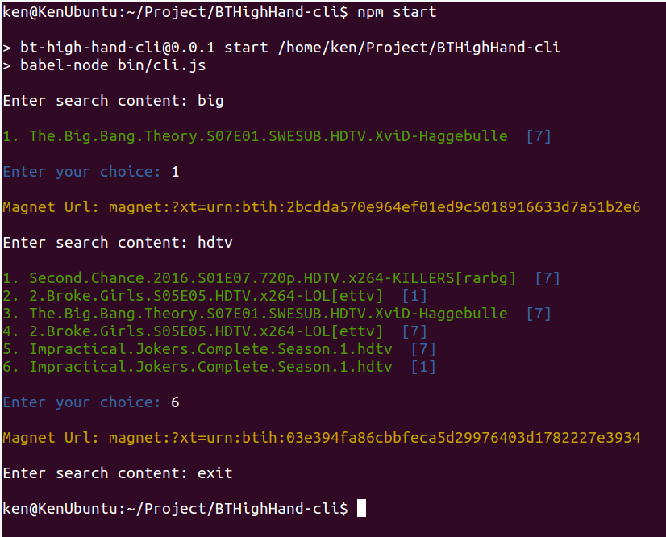

# bthhcli

Bit Torrent High Hand (bthh) 客户端，cli 版本

## 使用

1. 安装 mongodb

2. 启动 mongodb

3. 使用 [p2pspider](https://github.com/zhanjiaxia/p2pspider) 抓取磁力链接

4. 使用 [bthhserver](https://github.com/zhanjiaxia/bthhserver) 开启服务器

5. 安装 bthhcli

```sh
npm install
```

5. 启动本应用

```sh
npm start
```

## 命令

__exit__ : 退出

## 示例



